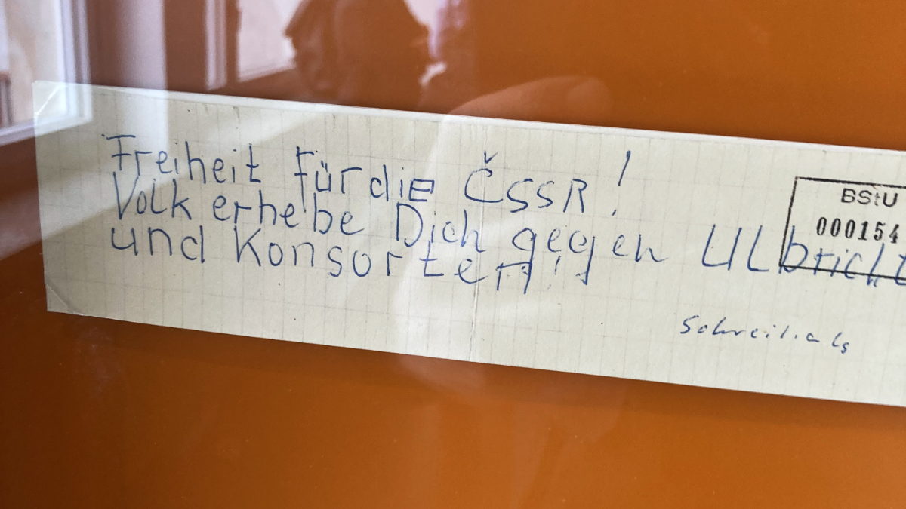
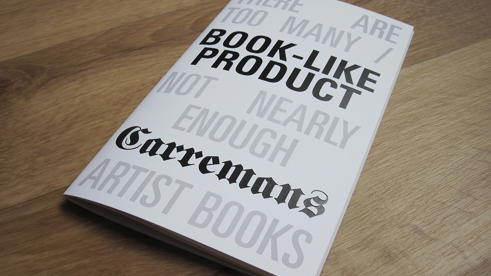
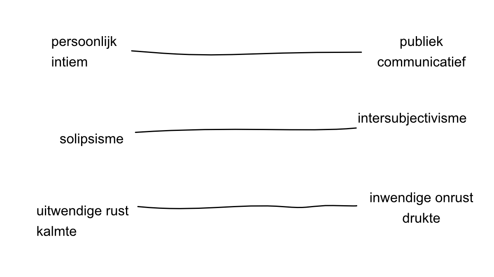

# Over *Zondag 25 oktober 2025, 15.12 uur* (december 2025)

==English below==

.webp)
.webp)
.webp)
.webp)
.webp)
.webp)
.webp)
.webp)

*Een wolk van gedachten / bewolkte gedachten.*

In het Stasi-museum in Berlijn hangt een stuk ruitjespapier met daarop een handgeschreven boodschap gekrabbeld. Dit was ooit een communicatiemiddel voor het verzet en vormt een van de drie uitgangspunten voor *Zondag 25 oktober 2025, 15.12 uur*. Het tweede is *Book-like product* (2015), een kunstenaarsboek met korte bewerkte passages waarin ik herinneringen ophaal aan mijn vriendschap met Bruce Lee en mijn verleden als crackdealer. Mijn recentere geschriften vormen het derde punt.

Niet al deze geschriften laten zich even goed vertalen naar hetzelfde medium. Sommige zijn misschien geschikt voor posters, andere voor een boekje en weer andere misschien voor voordracht. Het object uit het Stasi-museum diende als katalysator en zette me ertoe aan om alles met de hand op aparte stukjes ruitjespapier te schrijven.

Al snel besefte ik echter dat het doorgeven van een stuk papier – al dan niet clandestien – een drempel vormde. Ik zocht naar een manier om het communicatieve aspect te minimaliseren en een zekere afstand te creëren.

Dat deed ik door herhaling, door lagen toe te voegen met kalk- of carbonpapier en door fragmenten van verschillende schrijfsels te combineren. Het werk presenteert alle stukjes papier tegelijk, waardoor de kans kleiner is dat de kijker zich op de inhoud van afzonderlijke elementen concentreert.

Ik heb mijn behandeling van het papier bewust beperkt gehouden. (Wat je met stukjes papier kunt doen – maar niet hoeft – te doen: ze scheuren, in onregelmatige vormen knippen, perforeren, dubbel of in vieren vouwen, oprollen en uitrollen, de hoeken afronden of vierkant maken, in stukjes knippen, tussen de lijnen knippen, aan elkaar plakken, erop schrijven, erop typen, ...)

Geleidelijk aan vond het werk zijn plaats op de as van persoonlijk en intiem versus openbaar en communicatief, en op de as van intersubjectivisme versus solipsisme.

Op dit moment werd de ware betekenis van het werk duidelijk, en de titel helpt dit te verduidelijken. *Zondag 25 oktober 2025, 15.12 uur* is een specifiek moment dat alle notities verenigt. Tegelijkertijd impliceert het de gelijktijdigheid van al deze notities, wat het contrast versterkt tussen de constante activiteit van een enkel brein en wat, voor velen, het rustigste moment van de week is.

De derde as waarop het werk zich bevindt, is daarom die van externe sereniteit versus interne chaos en drukte.

Iemand heeft op een bepaald moment gedachten gehad, lijkt het werk zichzelf te relativeren. Cogito ergo sum. Of liever: ik denk, dus ik denk.

# About *Zondag 25 oktober 2025, 15.12 uur* (December 2025)

.webp)
.webp)
.webp)
.webp)
.webp)
.webp)
.webp)
.webp)

*A cloud of thinking / clouded thinking.*

In the Stasi Museum in Berlin, there is a piece of graph paper, scrawled with a handwritten message. This was once a means of communication for the resistance, and serves as one of the three foundational points for *Zondag 25 oktober 2025, 15.12 uur* (Sunday, 25 October 2025, 3:12 p.m.). The second is *Book-like product* (2015), an artist's book with short edited passages in which I recall memories of my friendship with Bruce Lee and my past as a crack dealer. My more recent writings form the third.

Not all of these writings translate equally well into the same medium. Some might be suited to posters, others to a booklet, and some perhaps to spoken word. The object from the Stasi museum served as a catalyst, prompting me to write everything by hand on separate pieces of graph paper.

Soon, however, I realised that the act of passing on a piece of paper — whether clandestinely or not — as an obstacle. I sought a way to minimise the communicative aspect and introduce a degree of distance.

I created distance through repetition, by adding layers with transfer or carbon paper, and by combining fragments of different writings. The work presents all the pieces of paper simultaneously, making it less likely that the viewer will focus on the content of individual elements.

I deliberately restricted my treatment of the paper. (What you can — but need not — do with pieces of paper: tear them, cut them into irregular shapes, perforate them, fold them in half or in quarters, roll them up and unroll them, round or square the corners, cut them into pieces, cut between the lines, stick them together, write on them, type on them, ...)

Gradually, the work found its place on the axis of personal and intimate versus public and communicative, and on the axis of intersubjectivism versus solipsism.

At this juncture, the true meaning of the work became clear, and the title aids in clarifying this. *Zondag 25 oktober 2025, 15.12 uur* is a specific moment that unites all the notes. At the same time, it implies the simultaneity of all these notes, amplifying the contrast between the constant activity of a single mind and what, for many, is the calmest moment of the week.

The third axis on which the work is positioned is therefore that of external serenity versus internal chaos and busyness.

Someone once had thoughts at a particular moment, the work seems to put itself into perspective. Cogito ergo sum. Or rather: I think, therefore I think.